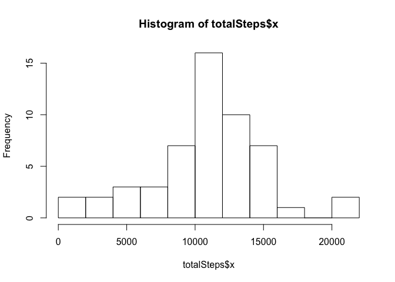
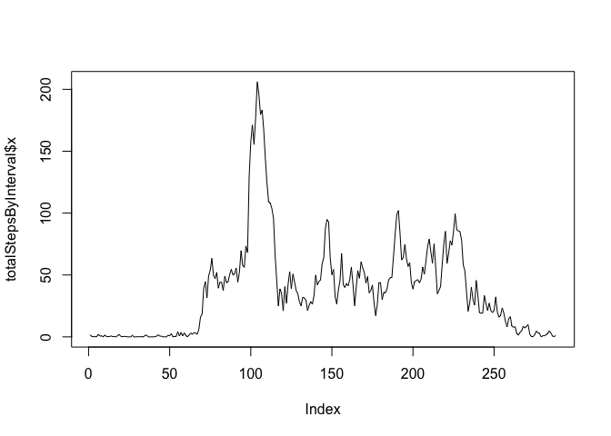
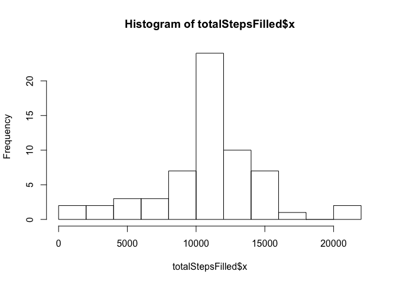
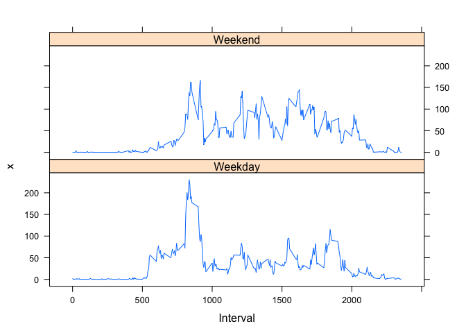

# Reproducible Research: Peer Assessment 1


## Loading and preprocessing the data

```r
unzip(zipfile = "activity.zip")
activity <- read.csv("activity.csv")
```


## What is mean total number of steps taken per day?

```r
totalSteps <- aggregate(activity$steps, list(Date = activity$date), sum)

hist(totalSteps$x, breaks = 10)
```

 

```r
mean(totalSteps$x, na.rm=TRUE)
```

```
## [1] 10766.19
```

```r
median(totalSteps$x, na.rm=TRUE)
```

```
## [1] 10765
```


## What is the average daily activity pattern?

```r
totalStepsByInterval <- aggregate(activity$steps, list(Interval = activity$interval), mean, na.rm=TRUE)

plot(totalStepsByInterval$x, totalStepsByInterval$y, type="l")
```

 

```r
totalStepsByInterval[which.max(totalStepsByInterval$x),]
```

```
##     Interval        x
## 104      835 206.1698
```


## Imputing missing values

```r
fillIn <- function(v) {
  if (is.na(v[1])) {
    v[1] <- totalStepsByInterval[totalStepsByInterval$Interval == as.numeric(v[3]),2]
  }
  v
}
r <- t(apply(activity, 1, fillIn))
activity_filled <- data.frame(as.numeric(r[,1]), r[,2], r[,3], stringsAsFactors = FALSE)
colnames(activity_filled) <- colnames(r)

totalStepsFilled <- aggregate(activity_filled$steps, list(Date = activity_filled$date), sum)

hist(totalStepsFilled$x, breaks = 10)
```

 

```r
mean(totalStepsFilled$x, na.rm=TRUE)
```

```
## [1] 10766.19
```

```r
median(totalStepsFilled$x, na.rm=TRUE)
```

```
## [1] 10766.19
```

## Are there differences in activity patterns between weekdays and weekends?


```r
library(lattice)
activity_filled["day"] <- factor(x = weekdays(strptime(activity_filled$date, "%Y-%m-%d")) %in% c("Sunday", "Saturday"), labels=c("Weekday","Weekend"))

totalStepsByIntervalWithDay <- aggregate(activity_filled$steps, list(Interval = activity_filled$interval, Day = activity_filled$day), mean, na.rm=TRUE)

totalStepsByIntervalWithDay["Interval"] <- as.numeric(totalStepsByIntervalWithDay$Interval)

xyplot(x ~ Interval|Day, data=totalStepsByIntervalWithDay, layout=c(1,2), type="l")
```

 

